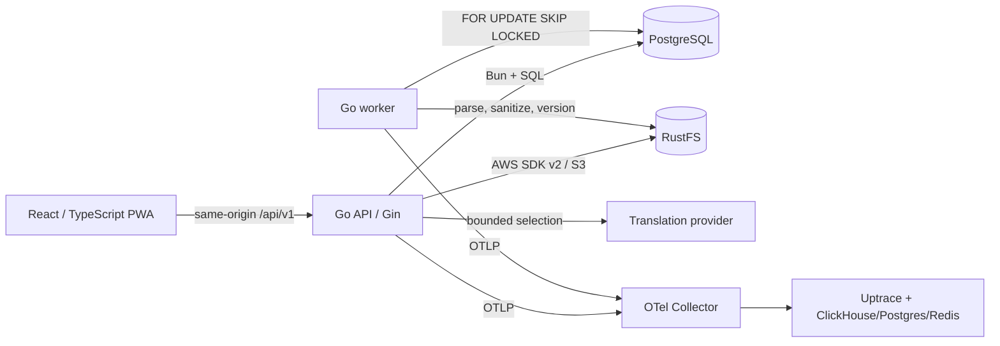

# BookFlow

BookFlow — monorepo веб‑сервиса для загрузки и чтения EPUB/FB2/TXT, синхронизации позиции между устройствами, корректного учёта активного времени, перевода выделенного текста, личного словаря, закладок, выделений и заметок.

> **Статус на 2026-07-16:** локальный MVP реализован и проверен на core-контуре. Все 69 операций OpenAPI сопоставлены с Gin routes; backend unit/race/integration tests, frontend static/unit/build checks, desktop/mobile Chromium Playwright demo-flow, OpenAPI lint/type generation, чистый Compose-запуск и реальный API acceptance через frontend proxy прошли. Это не означает production-ready/HA-релиз, 100% покрытие или прохождение каждого ручного accessibility/restore сценария. Точная матрица доказательств и ограничений находится в [`docs/implementation-plan.md`](docs/implementation-plan.md).

## Что реализовано в MVP

- регистрация, вход, короткоживущий access token, ротация refresh token и выход на одном/всех устройствах;
- персональная библиотека и безопасная асинхронная обработка EPUB, FB2 и TXT;
- встроенные и пользовательские JPEG/PNG/WebP-обложки с заменой и возвратом к оригиналу;
- чтение по одной главе в браузере, scroll/paginated режимы, Light/Warm/Sepia/Dark/Custom и настройки типографики;
- revision-safe позиция и продолжение чтения на другом устройстве;
- серверный учёт reading sessions: start/heartbeat/finish, idle/visibility/focus, replay-safe idempotency и stale finalization;
- дневная/недельная/месячная/книжная статистика с IANA timezone и листаемым календарём полных недель;
- mock-перевод без внешнего API и расширяемый `TranslationProvider`, PostgreSQL cache;
- дедуплицированный словарь с контекстом/occurrences и статусами знания;
- закладки, спокойные выделения, версионированные block notes и поиск;
- адаптивный React PWA shell, упрощённый sidebar без дублирующих Continue/Recent, command palette, клавиатурная навигация, русский и английский UI;
- темы всего приложения System/Light/Warm/Dark/Custom с настраиваемыми фоном, текстом и акцентом;
- PostgreSQL как источник истины, RustFS для бинарных/крупных объектов, PostgreSQL-backed worker jobs;
- structured logs, Prometheus metrics, OpenTelemetry wiring и опциональный Compose profile для полного Uptrace dependency set.

Основной upload → process → read → resume/heartbeat → translate/dictionary/annotations путь проверен реальным PostgreSQL 17, RustFS, API и worker. Browser E2E отдельно использует локальный demo transport; это важная граница его покрытия.

## Архитектура



Backend реализован как модульный монолит. Gin остаётся transport-слоем; use cases проверяют владение и транзакционные инварианты; Bun/PostgreSQL, RustFS, токены и переводчики — infrastructure adapters. API и worker являются разными stateless-процессами одного codebase. Телеметрия не является зависимостью чтения.

Подробности: [архитектура](docs/architecture.md), [данные](docs/data-model.md), [ADR](docs/decisions/README.md).

## Стек

| Область    | Технологии                                                                                                                                      |
| ---------- | ----------------------------------------------------------------------------------------------------------------------------------------------- |
| Backend    | Go, Gin, Bun, PostgreSQL, AWS SDK for Go v2, Argon2id/JWT, OpenTelemetry, `slog`, `testify`, `testcontainers-go`                                |
| Frontend   | React, TypeScript strict, Vite, React Router, TanStack Query, Zustand, React Hook Form, Zod, CSS variables/modules, Vitest/RTL, Playwright, PWA |
| Storage    | RustFS S3 API, раздельные buckets для originals/content/assets/covers/exports                                                                   |
| Async      | PostgreSQL queue, `FOR UPDATE SKIP LOCKED`, retry/backoff/dead-letter/idempotent handlers                                                       |
| Operations | Docker/Compose, Make, GitHub Actions, golangci-lint, ESLint/Prettier, Redocly OpenAPI lint, Uptrace stack                                       |

## Структура репозитория

```text
backend/
  cmd/                 # api, worker, migrate, seed
  internal/            # доменные/application/infrastructure модули
  migrations/          # парные SQL migrations
  openapi/openapi.yaml # OpenAPI 3.1 контракт, сверяемый с Gin route inventory
frontend/
  src/                 # app/pages/widgets/entities/shared/reader/api/stores/styles/i18n
  public/              # PWA assets
deploy/
  otel-collector/      # OTLP receiver/exporter config
  uptrace/             # локальный Uptrace config
docs/                  # архитектура, алгоритмы, безопасность, deployment и QA
scripts/               # env bootstrap, RustFS buckets, migrations, smoke
.github/workflows/     # CI без публикации образов
docker-compose.yml
Makefile
```

## Требования для локального запуска

- Docker Engine/Desktop и Docker Compose v2;
- ориентировочно 4 CPU / 8 GiB RAM / 15 GiB свободного места для полного observability profile;
- `make`, `openssl`, `curl`;
- Go/Node нужны только для host-side `make test/lint/build`, не для обычного Compose startup.

Проверка:

```bash
docker --version
docker compose version
make help
```

## Быстрый локальный запуск

### 1. Конфигурация

Самый простой безопасный для локальной машины способ генерирует независимые случайные JWT/CSRF/Uptrace secrets и не перезаписывает существующий `.env`:

```bash
make env
./scripts/validate-env.sh .env
```

Либо вручную:

```bash
cp .env.example .env
openssl rand -base64 48
# замените каждый CHANGE_ME на независимое значение и проверьте:
./scripts/validate-env.sh .env
```

Значения `bookflow_dev_only*` и seed password в примере предназначены только для loopback development. Production secrets нельзя хранить в Git, Docker image/build args или `VITE_*`.

### 2. Core stack

```bash
make up
docker compose --env-file .env ps
make smoke
```

Compose поднимает `postgres`, `rustfs`, one-shot `rustfs-init`, one-shot `migrations`, `api`, `worker` и `frontend`. API/worker ждут успешных migrations и bucket initialization. Данные сохраняются в named volumes.

Локальные адреса core stack:

- UI: <http://localhost:3000>;
- API напрямую: <http://localhost:8080>;
- health: <http://localhost:8080/health/live> и `/health/ready`;
- RustFS S3: <http://localhost:9000>;
- RustFS console: <http://localhost:9001>;
- PostgreSQL: `127.0.0.1:5432`.

Чистый запуск core stack с PostgreSQL 17, RustFS, migrations, API, worker и frontend был проверен 2026-07-16. Если локальный запуск не проходит, не отключайте health/dependency gates: начните с `docker compose ps -a`, логов one-shot сервисов и раздела Troubleshooting.

### 3. Uptrace и OpenTelemetry

```bash
make dev
# или в фоне:
OTEL_ENABLED=true docker compose --env-file .env --profile observability up -d --build
```

Profile описывает полный, а не фиктивный одиночный Uptrace dependency set: `uptrace`, `uptrace-clickhouse`, `uptrace-postgres`, `uptrace-redis` и `otel-collector`. UI: <http://localhost:14318>; логин/пароль берутся из `.env`. OTLP: `4317`/`4318`. Compose-модель profile прошла config validation, но полный observability runtime в текущей QA-сессии не запускался; этот профиль нельзя считать operationally verified. Он тяжёлый и не нужен для каждого unit-test цикла.

`make up` использует `OTEL_ENABLED=false` из примера и не требует работающего collector. `make dev` явно переопределяет его в `true`.

## Миграции

```bash
make migrate-status
make migrate-up
make migrate-create name=add_reading_index
make migrate-down DOWN_OK=1    # destructive acknowledgement
```

Текущий базовый набор начинается с `backend/migrations/000001_initial.up.sql` и парного down-файла. Перед production rollback/contract migration нужен backup/restore план; `down` не восстанавливает потерянные пользовательские данные.

## Первый пользователь и seed

Seed является opt-in и должен отказываться работать в production:

```bash
make seed
```

Учетные данные задаются в `.env`:

```text
SEED_USER_EMAIL=demo@bookflow.local
SEED_USER_PASSWORD=BookFlow-demo-only-2026!
```

Seed-путь проверен отдельно: два последовательных запуска завершились с exit code `0` примерно за `0.95s` и `0.92s`, при этом в PostgreSQL остался ровно один demo user. Запуск с `APP_ENV=production` завершился с ожидаемым отказом и exit code `1`, поэтому development seed не считается доступным production-механизмом создания пользователей.

HTTP auth доступен через `POST /api/v1/auth/register`:

```bash
curl --fail-with-body -sS http://localhost:8080/api/v1/auth/register \
  -H 'Content-Type: application/json' \
  -H 'X-Request-ID: 0196d44a-0ee0-7530-9b4a-f4bea9e8e590' \
  --data '{"email":"reader@example.com","password":"correct horse battery staple","display_name":"Reader"}'
```

Cookie/CSRF details и точные response DTO следует брать из [`backend/openapi/openapi.yaml`](backend/openapi/openapi.yaml). Route-level тесты проверяют неизвестные JSON-поля, locale validation, безопасный response без токенов в JSON, cookie/CSRF и refresh rotation/reuse.

## Загрузка тестовой книги

Не добавляйте защищённые авторским правом книги. Создайте синтетический TXT:

```bash
cat > /tmp/bookflow-sample.txt <<'EOF'
BookFlow Sample

Chapter 1
This short original text exists only to exercise the reader pipeline.

Chapter 2
The reader preserves progress without treating idle time as active reading.
EOF
```

После входа получите access token из фактического auth response (или используйте browser cookie + CSRF) и отправьте multipart:

```bash
curl --fail-with-body -sS http://localhost:8080/api/v1/books \
  -H "Authorization: Bearer $ACCESS_TOKEN" \
  -H "Idempotency-Key: $(openssl rand -hex 24)" \
  -F 'file=@/tmp/bookflow-sample.txt;type=text/plain'
```

Ответ — `202` с `book_id` и `processing_status`; затем опрашивайте `GET /api/v1/books/{bookId}/processing-status`. Реальный acceptance-прогон подтвердил этот путь для синтетических TXT, FB2 и EPUB, включая worker processing и чтение главы.

## RustFS

Compose использует проверенный официальный image tag из `.env.example`, health endpoint `/health`, named data/log volumes и AWS CLI init job. Создаются buckets:

```text
books-original
books-content
books-assets
books-covers
user-exports
```

Внутренний endpoint API — `http://rustfs:9000`, публичный browser endpoint — `http://localhost:9000` локально. В production публичный endpoint обязан быть HTTPS и доступен браузеру; permanent RustFS credentials браузеру не выдаются. Подробнее: [`docs/storage.md`](docs/storage.md).

## Переводчик

Локальный default:

```dotenv
TRANSLATION_PROVIDER=mock
```

Он не требует сети/API key и подходит для детерминированных тестов. Также реализован OpenAI Responses adapter со structured output, ограниченным контекстом, timeout/retry и process-local circuit breaker; PostgreSQL cache учитывает provider/model/prompt version и защищён single-flight. Наружу отправляется только выделение и ограниченный контекст, никогда глава/книга. Внешний адаптер unit-tested, но live-вызов внешнего OpenAI API в acceptance не выполнялся. Длинные переводы не переводятся в durable jobs и не имеют lease heartbeat. Подробнее: [`docs/translation-provider.md`](docs/translation-provider.md).

## OpenAPI

Полный контракт находится в [`backend/openapi/openapi.yaml`](backend/openapi/openapi.yaml): 69 operations на 49 paths (включая device management, авторизованные asset redirect и same-origin cover stream), cookie/bearer security, uploads, idempotency, conflicts, cursor pagination, schemas и единая ошибка. Скрипт `scripts/check-openapi-routes.py` сравнивает его с фактическим Gin route inventory.

```json
{
  "error": {
    "code": "NOT_FOUND",
    "message": "Book was not found",
    "details": {},
    "request_id": "0196d44a-0ee0-7530-9b4a-f4bea9e8e590"
  }
}
```

```bash
make lint-openapi
make generate-openapi   # TypeScript types -> frontend/src/api/schema.d.ts
```

После финального уточнения heartbeat schema генерация проходит без предупреждений; текущий `frontend/src/api/schema.d.ts` содержит 4,140 строк, а последующие frontend lint и typecheck проходят.

Группы endpoint:

- `/api/v1/auth/*` — register/login/refresh/logout/logout-all/me;
- `/api/v1/books*` — upload/list/detail/update/delete/reprocess/status/TOC/chapter/download;
- progress и global/per-book reader preferences;
- reading sessions start/heartbeat/finish/list/detail;
- word/text translation и language detection;
- dictionary CRUD/restore/occurrences/export;
- bookmarks, highlights и notes;
- overview/daily/weekly/monthly/books/sessions/streak/dictionary statistics;
- `/health/live`, `/health/ready`, `/metrics`.

## Команды Makefile

| Команда                           | Назначение                                                       |
| --------------------------------- | ---------------------------------------------------------------- |
| `make env`                        | создать `.env` и случайные локальные secrets без перезаписи      |
| `make dev`                        | foreground core + полный observability profile                   |
| `make up`                         | core stack в фоне                                                |
| `make down`                       | остановить core/optional containers, сохранить volumes           |
| `make restart`                    | `down` + `up`                                                    |
| `make build`                      | Go/frontend/container builds                                     |
| `make test`                       | unit + integration targets                                       |
| `make test-unit`                  | Go race/short и frontend Vitest                                  |
| `make test-integration`           | Go `integration` build tag; Docker нужен для testcontainers      |
| `make test-e2e`                   | Playwright                                                       |
| `make lint`                       | Go/frontend/OpenAPI/Compose static checks                        |
| `make format`                     | gofmt + Prettier write                                           |
| `make migrate-up`                 | применить migrations                                             |
| `make migrate-down DOWN_OK=1`     | откатить один шаг с явным подтверждением                         |
| `make migrate-create name=x`      | создать SQL up/down пару                                         |
| `make seed`                       | idempotent development seed                                      |
| `make generate-openapi`           | сгенерировать TypeScript API types                               |
| `make logs services="api worker"` | follow логов выбранных сервисов                                  |
| `make smoke`                      | live/ready/frontend HTTP smoke                                   |
| `make clean`                      | удалить build/test artifacts; volumes только с `CLEAN_VOLUMES=1` |

## Тесты и CI

```bash
make test-unit
make test-integration
make test-e2e
make lint
make build
```

GitHub Actions определяет jobs для gofmt/vet/unit/race/build, golangci-lint, integration, migration up/down/up, ESLint/Prettier/typecheck/Vitest/frontend build, OpenAPI route inventory/lint, Compose render и двух Docker builds. Образы не публикуются.

На локальном snapshot 2026-07-16 подтверждены:

- backend unit, short race, vet, build, gofmt, tidy и golangci-lint;
- integration-tagged suite с реальными PostgreSQL 17 и RustFS, включая auth reuse, ownership, optimistic concurrency, sessions, cache, annotations, statistics, jobs и book processing;
- frontend format/lint/typecheck, 40 Vitest tests и production/PWA build;
- Playwright: 14 тестов прошли и 2 project-specific skip ожидаемы; оба проекта используют Chromium/Chromium-based Pixel 7 и `VITE_DEMO_MODE=true`; отдельно выполнен authenticated real-API acceptance для словаря без перевода;
- OpenAPI route inventory `69/49`, Redocly без ошибок/предупреждений, генерация 4,288-строчной TypeScript schema и последующие frontend lint/typecheck;
- финальные backend images `api`, `worker` и `migrations` собраны из текущего source командой `docker compose --env-file ../work/qa.env build api worker migrations` за `11.61s`; финальный frontend image также пересобран;
- seed дважды прошёл идемпотентно, оставив одного demo user, и ожидаемо отказался запускаться с `APP_ENV=production`;
- чистый core Compose, live/ready/frontend smoke, реальный API acceptance через frontend proxy и restart/persistence regression после принудительного пересоздания API.
- production frontend проверен браузерной регистрацией через `http://127.0.0.1:3000`: `POST /auth/register` → `201`, переход в Library, одна активная sidebar-ссылка, без page errors; loopback CORS разрешает и `localhost`, и `127.0.0.1`.
- custom app theme проверена на production frontend: три цвета применяются ко всему shell, переживают reload, desktop/mobile не имеют horizontal overflow; desktop sidebar и mobile drawer не содержат Continue/Recent, console после чистой перезагрузки без ошибок.
- paged reader проверен отдельным desktop/mobile Chromium E2E: системный scrollbar скрыт, свободная позиция автоматически доводится до ближайшей границы страницы, keyboard navigation переходит ровно на одну колонку.
- header и нижняя status-панель читалки закреплены постоянно: они остаются видимыми после фокуса, клика, скролла и периода бездействия.
- словарь поддерживает ручное добавление, отдельные перевод и значение/описание, русские одноязычные записи без перевода, поиск по описанию и явную ошибку сохранения из читалки; сценарий проверен в desktop/mobile E2E и на реальном API.
- реальный пользовательский EPUB с XHTML `<title/>` переобработан после XML-aware sanitizer fix: current version содержит 49 глав, 0 `Chapter N`, 0 escaped-document fragments и 0 HTML markup в `content_text`; русские NCX-заголовки, абзацы, emphasis и superscript сохранены, а progress remapped на current-version chapter ID.

Restart-проверка подтвердила, что frontend продолжает проксировать API после `force-recreate`, а PostgreSQL/RustFS сохраняют пользовательские metadata, progress/preferences, TOC, reading session и 152-байтовый оригинал книги. Для этого frontend Nginx использует Docker DNS resolver `127.0.0.11`, динамически разрешаемый upstream и shared upstream zone; `nginx -t` и пересобранный frontend image прошли. Это проверка локальной persistence, а не production backup/restore.

Vitest statement coverage составляет 23.55% (40 тестов в 17 файлах); это стартовое покрытие критичных frontend primitives, а не доказательство полного UI coverage. Точные команды и границы evidence: [`docs/implementation-plan.md`](docs/implementation-plan.md).

Подробная тестовая матрица: [`docs/testing.md`](docs/testing.md).

## Production deployment

Локальный Compose — single-host reference, **не** HA production platform. Перед внешним запуском обязательны TLS/reverse proxy, exact CORS/cookie/trusted proxies, secret manager, pinned image digests/SBOM/scanning/signing, PostgreSQL TLS/PITR/backup, redundant TLS RustFS + backup/replication, resource/network policies, independently масштабируемые API/worker, alerts, migration rollout и проверенный coordinated restore.

Полный release/backup/restore/troubleshooting runbook: [`docs/deployment.md`](docs/deployment.md). Security controls и незакрытые проверки: [`docs/security.md`](docs/security.md).

## Известные ограничения

На snapshot 2026-07-16:

1. Browser E2E проверяет UI в Chromium и Chromium-based mobile profile с `VITE_DEMO_MODE=true`; он не является браузерным E2E реального API. Реальный PostgreSQL/RustFS/worker flow проверен отдельным HTTP acceptance через frontend proxy.
2. Optional observability profile проходит `docker compose config`, а OTel/metrics wiring покрыт build/smoke, но полный Uptrace + ClickHouse + PostgreSQL + Redis + Collector runtime не поднимался в текущей QA-сессии.
3. `median_session_seconds` и `translations_count` в overview пока возвращают `0`, а не рассчитанные агрегаты.
4. Сессия, пересекающая локальную полночь, целиком относится к дате `started_at`; active/idle seconds по границе суток пока не разрезаются.
5. Dictionary export возвращает первые 100 записей одним JSON-ответом; фонового полного экспорта в `user-exports` и cursor/chunk streaming нет.
6. HTTP rate limiting хранится в памяти процесса. При нескольких API replicas лимит не общий; нужен Redis/edge limiter либо другой распределённый backend.
7. Переводы выполняются синхронно в HTTP request. Для длинных переводов нет durable job, lease heartbeat или resumable result; внешняя OpenAI интеграция не проверялась live credentials.
8. Locator остаётся неоднородным: storage/use cases допускают format-specific JSON, часть HTTP/frontend DTO использует строку. Полная interoperability EPUB CFI, chapter offset и offline conflict replay не доказана.
9. PWA offline — ограниченный MVP (shell/последняя глава/position queue), не полноценный offline-first; реальный multi-device 409 conflict UX не покрыт browser E2E.
10. RustFS local volume single-node и не заменяет redundancy/backup. Production orchestration, TLS issuance, registry publishing/signing, automated PITR/backup и secret-manager integration намеренно не выдаются за готовые.
11. Полный ручной accessibility screen-reader audit, production-like backup/restore drill и optional observability runtime остаются отдельными release gates; пройденные автоматизированные проверки не означают 100% coverage.
12. Reprocess повторно извлекает metadata из файла и сейчас заменяет изменённый пользователем title извлечённым title. Chapter-bound progress/bookmarks/highlights/occurrences уже remap'ятся на новую processing version; policy слияния пользовательского title всё ещё требует отдельного решения.

Самый точный список по каждому workstream: [`docs/implementation-plan.md`](docs/implementation-plan.md).

## Troubleshooting

```bash
./scripts/validate-env.sh .env
docker compose --env-file .env --profile observability config --quiet
docker compose --env-file .env ps -a
make logs services="migrations rustfs rustfs-init api worker frontend postgres"
curl -fsS http://localhost:9000/health
curl -fsS http://localhost:8080/health/live
curl -fsS http://localhost:8080/health/ready
```

- **`CHANGE_ME` / interpolation error:** выполните `make env` или замените все placeholders вручную.
- **API/worker не стартуют:** сначала проверьте one-shot `migrations` и `rustfs-init`; зависимости блокируются намеренно.
- **Presigned URL содержит `rustfs:9000`:** разделите internal/public RustFS endpoint; браузеру нужен reachable URL.
- **Нет traces:** запущен ли `observability` profile, включён ли `OTEL_ENABLED`, совпадает ли project token; проверьте collector/Uptrace logs.
- **`make test-integration` не стартует:** проверьте работающий Docker daemon, доступ к socket/registry и возможность скачать PostgreSQL/RustFS test images.
- **Port занят:** измените loopback mapping или остановите конфликтующий процесс; не публикуйте data ports на `0.0.0.0` как временный workaround.
- **После восстановления readiness false:** проверьте migrations, buckets и trusted object references; не отключайте readiness, чтобы скрыть рассогласование.

## Документация

- [Architecture](docs/architecture.md)
- [Data model](docs/data-model.md)
- [Reading-session algorithm](docs/reading-session-algorithm.md)
- [Book processing](docs/book-processing.md)
- [Translation provider](docs/translation-provider.md)
- [RustFS storage](docs/storage.md)
- [Security](docs/security.md)
- [Design system](docs/design-system.md)
- [Deployment/operations](docs/deployment.md)
- [Testing](docs/testing.md)
- [Implementation status/plan](docs/implementation-plan.md)
- [Architecture decisions](docs/decisions/README.md)
- [OpenAPI 3.1](backend/openapi/openapi.yaml)
