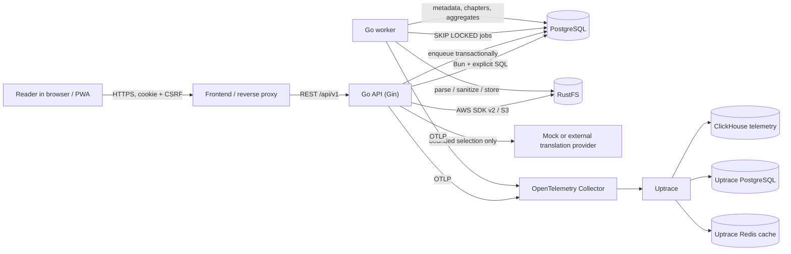
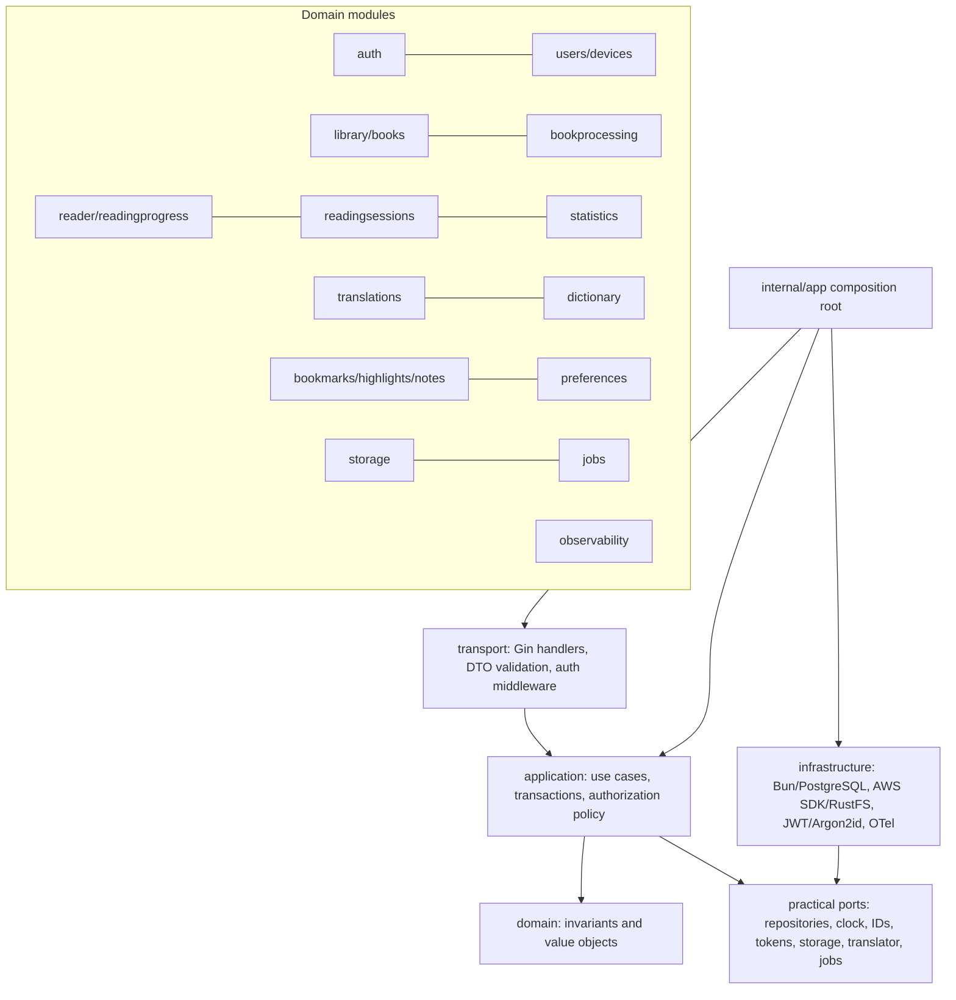

# BookFlow architecture

> **Document type: target architecture and invariants.** It does not assert that every module/flow is wired today. See [implementation-plan.md](implementation-plan.md) for the checked-in implementation and verification status.

## Goals and boundaries

BookFlow is a **modular monolith**: one API binary, one worker binary, one PostgreSQL database, and one S3-compatible RustFS deployment. This keeps transactions, deployment, and operations understandable for the MVP while preserving domain boundaries that can later become service boundaries. Reliability of book objects and reading progress, correct active-time accounting, and user-resource isolation have priority over decorative features.

The browser never receives database credentials or permanent RustFS credentials. It calls the same-origin frontend proxy (`/api/*`); the API authorizes the user and may return a short-lived presigned URL only for an object the user owns.

## System context



The Uptrace dependencies are deliberately separate from the application PostgreSQL. They run only with the Compose `observability` profile and are not part of BookFlow's source-of-truth data.

## Runtime containers

| Container | Responsibility | Persistence | Exposed locally |
|---|---|---|---|
| `frontend` | Static PWA and `/api` reverse proxy | image only | `127.0.0.1:3000` |
| `api` | HTTP transport and application use cases | none | `127.0.0.1:8080` |
| `worker` | PostgreSQL jobs, parsing, cleanup, aggregation | none | none |
| `migrations` | one-shot schema migration before API/worker | migration table in PostgreSQL | none |
| `postgres` | all durable relational BookFlow state | `postgres-data` | `127.0.0.1:5432` |
| `rustfs` | original files, covers, assets, large chapter content, exports | `rustfs-data`, `rustfs-logs` | `127.0.0.1:9000/9001` |
| `rustfs-init` | idempotent bucket creation | none | none |
| observability profile | Collector, Uptrace, ClickHouse, PostgreSQL, Redis | named volumes | UI `127.0.0.1:14318`, OTLP `4317/4318` |

## Backend modules and dependency direction



Rules:

1. Gin types stop at transport boundaries. Handlers parse, validate, call a use case, and map results/errors.
2. HTTP DTOs and persistence models are distinct when their contracts differ.
3. A repository interface exists only when it supports a real seam: testing, transactions, or an alternative adapter.
4. `context.Context` is passed to every I/O call and is never stored in a struct.
5. Use cases perform ownership checks from the authenticated subject; they never accept `user_id` from a mutation body.
6. Cross-table invariants use explicit PostgreSQL transactions. Object-store writes use compensating/idempotent state because PostgreSQL and S3 cannot share a transaction.
7. Complex statistics and queue claims use explicit SQL; Bun remains the required ORM/query layer for ordinary persistence.

## Critical flows

### Upload and processing

```mermaid
sequenceDiagram
    actor U as User
    participant A as API
    participant P as PostgreSQL
    participant S as RustFS
    participant W as Worker
    U->>A: multipart EPUB/FB2/TXT + Idempotency-Key
    A->>A: bounded stream, signature/MIME/size, SHA-256
    A->>P: transaction: book + file + queued job
    A->>S: Put original at opaque deterministic key
    A->>P: mark original stored / job runnable
    A-->>U: 202 book_id, queued
    W->>P: SELECT ... FOR UPDATE SKIP LOCKED
    W->>S: Get original
    W->>W: parse, normalize, sanitize, enforce archive limits
    W->>S: idempotent covers/assets/content writes
    W->>P: replace version rows transactionally; ready
```

If object upload fails, the book remains diagnosable and is not advertised as ready. If parsing fails, the immutable original stays in RustFS. Reprocessing writes a new content version and only switches the active version after all required data succeeds.

### Reading and progress

```mermaid
sequenceDiagram
    participant PWA as Reader PWA
    participant API as API
    participant DB as PostgreSQL
    PWA->>API: POST /reading-sessions (idempotency key)
    API->>DB: create active session
    loop approximately every 15 seconds
      PWA->>API: heartbeat(sequence, visibility, focus, activity)
      API->>DB: lock session; dedupe key; credit bounded server interval
      API-->>PWA: credited time + server time
    end
    PWA->>API: PUT progress(revision, locator)
    API->>DB: update only if revision is current
    alt newer cross-device progress exists
      API-->>PWA: 409 + current server state
    end
    PWA->>API: finish or sendBeacon
    API->>DB: idempotent finalization
```

See [reading-session-algorithm.md](reading-session-algorithm.md) for exact accounting rules.

## Source-of-truth and consistency

| Data | Source of truth | Consistency rule |
|---|---|---|
| user/auth/device state | PostgreSQL | transaction + hashed refresh tokens |
| book metadata and processing state | PostgreSQL | status state machine and version pointer |
| original/cover/assets/large content | RustFS | opaque keys recorded in PostgreSQL; SHA-256 integrity |
| progress | PostgreSQL | `(user, book)` uniqueness + monotonically increasing revision |
| sessions/events | PostgreSQL | server timestamps + idempotency/sequence constraints |
| statistics | sessions/events are canonical; aggregates are derived | idempotent rebuild by date/book |
| translations | provider result cache in PostgreSQL | normalized/versioned cache key + TTL |
| notes/dictionary/annotations | PostgreSQL | soft delete where restoration/audit is required |
| telemetry | Uptrace stack | operational only; never required to read a book |

## Failure model

- API and worker are stateless and may restart or scale horizontally.
- PostgreSQL job claims use `FOR UPDATE SKIP LOCKED`, lease metadata, bounded attempts, exponential backoff, and dead-letter state.
- Every external call has a deadline; retry only retryable failures and use jitter.
- Jobs and public mutations that can be replayed carry idempotency keys.
- Readiness fails when PostgreSQL or required RustFS access fails; liveness does not depend on them.
- Shutdown stops intake, cancels work, flushes telemetry within a deadline, and releases job leases safely.

## Scaling path

Scale API and worker replicas independently first. Partition hot session/event indexes by time only after measured need. Move chapter delivery behind a CDN using short-lived signed URLs if authorized traffic justifies it. A module may become a service only when ownership, load, or independent deployment warrants the operational cost; the initial candidates are book processing and translation, not auth or progress.

## Architecture decisions

Decision records are in [`docs/decisions/`](decisions/README.md). A decision is accepted for this repository but can be superseded by a later ADR; documentation must change with code.
