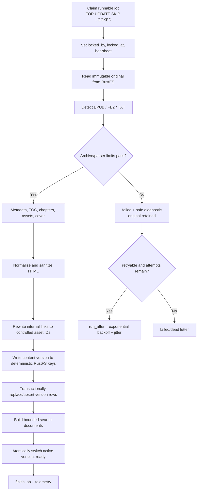

# Book upload and processing

> **Document type: target processing contract.** Parser/processor building blocks do not by themselves prove the durable upload, version-switch, reconciliation, or worker flows below. See [implementation-plan.md](implementation-plan.md).

## Accepted formats and parser contract

MVP parsers accept EPUB, FB2, and TXT. A parser owns detection, metadata, table of contents, chapters, assets, and plain-text extraction behind a `BookParser` port. PDF, MOBI, AZW3, and Markdown can be added without changing upload/session APIs. Detection must inspect content/signatures; the filename extension and client MIME are hints only.

## Upload path

1. Stream into a bounded temporary file; never read an unbounded body into memory.
2. Enforce request and per-file byte limits before/during streaming.
3. Normalize the filename only for display; never use it as an object key or filesystem path.
4. Verify allowed extension, sniffed MIME, and signature/container structure.
5. Compute SHA-256 while streaming and deduplicate within the authenticated user's library.
6. Create book/file/job state transactionally and claim the request idempotency key.
7. Upload the immutable original under an opaque/deterministic key.
8. Mark storage complete and make the processing job runnable; return `202` with the book ID/status.

Cross-resource failure is handled by explicit states and repair jobs, not a fictitious distributed transaction. A database record whose upload failed is diagnosable/retryable; an orphan object is safe to find by inventory and age before deletion.

## Worker flow



### Format notes

- **EPUB:** it is a ZIP archive and must satisfy file-count, total-uncompressed-size, per-entry-size, path, nesting, and compression-ratio limits. Reject absolute paths, `..`, symlinks, encrypted entries, unsafe URLs, and malformed container/OPF data. Do not extract into a shared directory. A complete XHTML spine document is parsed as XML first and only the `<body>` fragment is sent to the HTML allowlist; this is required because valid XHTML such as `<title/>` has different raw-text semantics in an HTML5 tokenizer and can otherwise turn the rest of the chapter into escaped text. EPUB 2 NCX and EPUB 3 navigation labels are resolved relative to the navigation document with fragments removed. Common generated `title`/`title1`…`title6` blocks are normalized to valid `h1`…`h6`, while external CSS and inline styles are discarded so reader typography remains controlled.
- **FB2:** use a streaming XML decoder with external entities disabled/not supported. Decode base64 binaries with explicit size/type limits; sanitize generated markup.
- **TXT:** validate/convert a supported encoding deterministically, cap line/paragraph sizes, escape HTML, and split chapters with a documented heuristic.

### HTML and assets

Only an allowlist of semantic reading tags/attributes survives. Remove scripts, forms, iframes, embeds, event attributes, CSS capable of external loads or layout escape, `javascript:`/unsafe data URLs, and unexpected network references. Rewrite internal image/anchor references to server-known chapter/asset IDs. Apply a restrictive reader Content Security Policy as defense in depth.

## Idempotency and versions

A processing attempt targets `(book_id, source_file_version, content_version)`. Chapter and asset upserts use parser-stable IDs or deterministic hashes and unique constraints; retrying cannot append duplicate rows. Writes go to a staging version. Only after required objects and database rows exist does one transaction set `books.active_content_version` and `ready`. Old versions remain available for a short rollback/reader grace period and are cleaned asynchronously.

Reprocess requests are idempotent and create at most one runnable job for a source version. Failed jobs never delete the original. Cleanup only deletes keys selected from trusted database rows/prefix construction and rechecks that no active version references them.

Because current chapter IDs include `processing_version`, the final processing transaction also remaps durable `reading_progress`, `bookmarks`, `highlights`, and `word_occurrences` references from old chapters to the new version by `(source_ref, occurrence)`. The progress revision is advanced in that same transaction, preventing a stale client write from silently restoring an old chapter ID. A repeated delivery of an already completed processing job is a no-op.

## Queue semantics

```mermaid
sequenceDiagram
    participant W1 as Worker 1
    participant DB as PostgreSQL
    participant W2 as Worker 2
    W1->>DB: BEGIN; select runnable FOR UPDATE SKIP LOCKED
    W2->>DB: BEGIN; select runnable FOR UPDATE SKIP LOCKED
    DB-->>W1: job A
    DB-->>W2: job B
    W1->>DB: lease A; COMMIT
    W2->>DB: lease B; COMMIT
    loop long processing
      W1->>DB: renew lease if still owner
    end
    W1->>DB: idempotent handler transaction + finish
```

Lease expiry permits recovery after a crash. Attempt counters, bounded error codes, safe summaries, timestamps, worker ID, and trace/request correlation make failures supportable. Retry transient PostgreSQL/RustFS/provider errors; do not blindly retry a corrupt EPUB or permanent limit violation.

## Search and storage choice

Metadata and chapter search documents live in PostgreSQL. Small chapter HTML can live in PostgreSQL for simple transactional reads; large content goes to `books-content`, with byte size, checksum, media type, and version in PostgreSQL. The API always fetches one chapter at a time and supports ETag caching.
