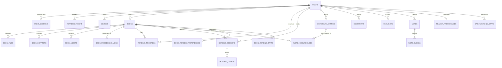

# Data model

> **Document type: target data contract.** The initial migration may implement only a subset or use transitional names; reconcile this document with migrations before claiming a capability complete. Current status is in [implementation-plan.md](implementation-plan.md).

PostgreSQL is the authoritative database for users, ownership, progress, sessions, vocabulary, annotations, jobs, and derived statistics. Binary book data is never stored in PostgreSQL. All timestamps use `timestamptz` and application code treats them as UTC; an IANA timezone is applied only when building calendar aggregates.

## Relationship overview

## Tables and invariants

### Identity and authentication

- `users`: public UUID, case-insensitive canonical email uniqueness, Argon2id password hash, locale and timezone.
- `devices`: belongs to one user; stable client identifier is unique per user; `last_seen_at` supports the active-device UI.
- `user_sessions`: browser/login session, device, expiry, revocation and last activity.
- `refresh_tokens`: only a cryptographic hash is persisted; family/parent IDs support rotation and replay detection. A used or revoked token cannot be used again.

### Books and parsed content

- `books`: user ownership, editable metadata, format, active content version and `uploaded → queued → processing → ready|failed` state.
- `authors` and `book_authors`: normalized many-to-many author relation with stable ordering.
- `book_files`: immutable original/version metadata, SHA-256, byte size, detected MIME, RustFS bucket/key, and storage state. Recommended duplicate constraint is `(user_id, sha256)` for non-deleted originals.
- `book_chapters`: `(book_id, content_version, ordinal)` and parser-stable source identifier are unique. Small sanitized HTML may be inline; large HTML uses a RustFS reference.
- `book_assets`: unique source path/hash within a content version; safe media type and dimensions where known.
- `book_processing_jobs`: processing-specific diagnostics and link to the general queue job when that queue is shared.

### Reader state

- `reading_progress`: exactly one current row per `(user_id, book_id)`. `revision` increases by one in the same conditional update that changes the locator. `device_id`, `client_id`, server timestamp, CFI/locator JSON, chapter offset, text anchor, and percentages provide recovery options.
- `reader_preferences`: one global row per user; constrained theme/font/layout values and a revision.
- `book_reader_preferences`: sparse override unique by `(user_id, book_id)`; effective settings merge with global preferences.

### Sessions and events

- `reading_sessions`: the server-time accounting state described in the algorithm document. Non-negative checks apply to all counters and 0–100 checks to progress.
- `reading_events`: bounded audit events only, not scroll events. Unique `(session_id, idempotency_key)` and guarded sequence number prevent replay amplification.
- An optional partial unique index for one `active|idle` session per `(user_id, device_id, book_id)` prevents accidental duplicate starts while allowing history.

### Dictionary, translations and annotations

- `translation_cache`: unique hash of normalized text, languages, provider/model, prompt version, request type, and result version. It records TTL, last use, and use count.
- `dictionary_entries`: unique active entry on `(user_id, source_language, target_language, normalized_word)`. `deleted_at` enables restore; uniqueness should include deleted-row policy explicitly via a partial index.
- `word_occurrences`: exact book/chapter locator and bounded context. Creating an occurrence and incrementing `encounter_count` is one transaction.
- `bookmarks`, `highlights`: every row carries `user_id` even though ownership is derivable from the book. This enables direct authorization/indexing but must be checked against book ownership on insert.
- `notes` and `note_blocks`: relational note identity/order with a versioned, validated JSON payload only where block type shapes differ. Raw arbitrary HTML is not persisted or trusted.

### Queue, idempotency, audit and aggregates

- General jobs contain `type`, validated payload, status, priority, attempts, `run_after`, lease fields, bounded error summary and timestamps. Claim uses an index such as `(status, run_after, priority DESC, created_at)`.
- `idempotency_keys`: scoped by user, operation, and key; request fingerprint prevents a key from being reused with a different payload; response metadata has a finite retention period.
- `audit_logs`: security and destructive actions, actor, resource identifiers, result, request ID and safe metadata. Never store credentials or book/translation text.
- `daily_reading_stats` and `book_reading_stats`: derived and replaceable. Their natural aggregation dimensions are unique, so upserts/rebuilds are deterministic.

## Index strategy

Minimum useful indexes:

1. ownership/listing: `books(user_id, deleted_at, added_at DESC)`, plus status and last-read variants;
2. progress: unique `(user_id, book_id)` and `updated_at` for sync;
3. sessions: `(user_id, started_at DESC)`, `(book_id, started_at DESC)`, and partial stale scan on unfinished sessions by `last_heartbeat_at`;
4. events: `(session_id, sequence_number)`, unique idempotency, and time-range indexes;
5. dictionary: partial unique normalized key, `(user_id, last_seen_at DESC)`, status/language filters, and a generated search vector for word/translation;
6. notes/books: PostgreSQL full-text indexes on normalized, user-owned search documents; GIN is justified here, not on every JSON field;
7. queue: partial runnable index and lease-expiry index;
8. translation cache: unique cache hash and expiry/last-used cleanup index.

Every unbounded collection endpoint must use a stable tie-breaker (usually UUID after timestamp) in its cursor. Query plans for library, session history, and dictionary search must be captured with realistic cardinality before adding speculative indexes.

## Deletion and retention

User-facing restores use soft deletion only where required (dictionary, optionally notes). Book deletion first marks the row and queues object cleanup; it does not trust a client-supplied key. Audit retention, idempotency keys, translation cache, raw reading events, and failed-job diagnostics each need explicit deployment retention. Aggregate rebuilds must remain possible from retained canonical sessions/events.
