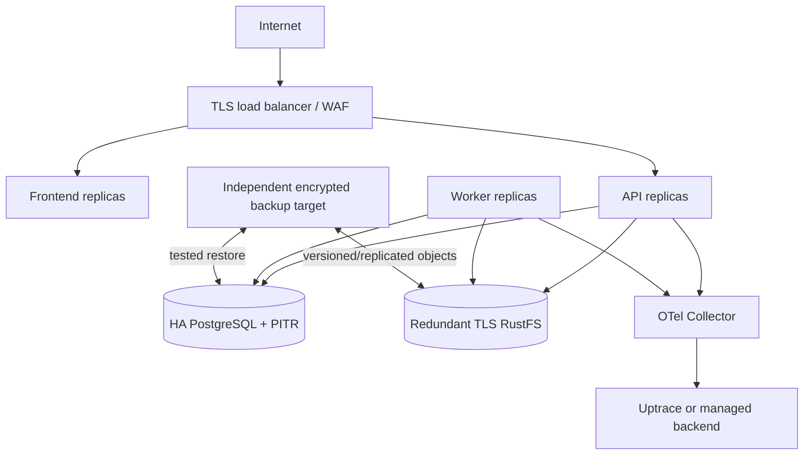

# Deployment and operations

> **Document type: runbook and production requirements.** Local commands must be reverified whenever Dockerfiles/configuration change; local Compose is not presented as a production HA deployment. Current evidence is in [implementation-plan.md](implementation-plan.md).

## Local prerequisites

- Docker Engine/Desktop with Compose v2 and at least 4 CPU, 8 GiB RAM, and 15 GiB free disk if the observability profile is enabled;
- Go and Node.js only for host-side development/test targets;
- `make`, `curl`, and `openssl` for the documented setup helpers.

RustFS runs as a non-root user in its image and uses named volumes, avoiding host bind-mount ownership issues. The base ports bind to `127.0.0.1`; change the deployment topology rather than binding development services publicly.

## Local startup

```bash
cp .env.example .env

# Replace every CHANGE_ME value. Use independent values, for example:
openssl rand -base64 48  # JWT signing key
openssl rand -base64 48  # CSRF secret
openssl rand -hex 32     # each database/object/Uptrace password/token

./scripts/validate-env.sh .env
make up                 # core stack, telemetry export disabled by default
make smoke
```

Use `make dev` instead to run in the foreground with the complete Uptrace profile and `OTEL_ENABLED=true`. The profile adds ClickHouse, a dedicated Uptrace PostgreSQL, Redis and the OpenTelemetry Collector, so first start is substantially heavier.

| Service | URL/connection |
|---|---|
| frontend | <http://localhost:3000> |
| direct API | <http://localhost:8080> |
| liveness/readiness | `/health/live`, `/health/ready` |
| RustFS S3 / console | <http://localhost:9000>, <http://localhost:9001> |
| PostgreSQL | `localhost:5432` with `.env` values |
| Uptrace profile | <http://localhost:14318> |
| OTLP profile | `localhost:4317` gRPC, `localhost:4318` HTTP |

`migrations` must complete and `rustfs-init` must create all buckets before API/worker start. Data survives `docker compose down`; only `make clean CLEAN_VOLUMES=1` (or `docker compose down -v`) deletes it.

## Migrations and seed

```bash
make migrate-status
make migrate-up
make migrate-create name=add_example       # creates .up.sql/.down.sql pair
make migrate-down DOWN_OK=1                # intentionally guarded
make seed                                  # development only, idempotent
```

The production release process runs a backward-compatible migration as a one-shot task before new API/worker replicas become ready. Take a tested backup before destructive/long migrations. Prefer expand/migrate/contract across releases; never assume a down migration is a safe substitute for restoring lost data.

## Production topology

The repository Compose file is a local/single-host reference, not a high-availability control plane. A small production deployment may reuse its images and health model, but must provide:

1. TLS termination/reverse proxy, real DNS, exact trusted proxy/CORS/cookie domains, HSTS, request/body limits and edge rate limiting;
2. pinned image versions or digests from a private registry, SBOM/signature/vulnerability policy, non-root/minimal runtimes and resource limits;
3. PostgreSQL with TLS, backups/PITR, monitored storage/connections and a least-privilege application role; migration credentials should be separate;
4. a supported redundant RustFS layout with TLS, private S3 network, least-privilege credentials/bucket policies, capacity monitoring, replication/backups and a browser-reachable `RUSTFS_PUBLIC_ENDPOINT`;
5. secrets from a secret manager/injected files rather than committed `.env` or `VITE_*` build args;
6. multiple API replicas behind a load balancer, independently scalable worker replicas, graceful termination longer than request/job shutdown deadlines;
7. Uptrace/collector sized and retained independently, or a managed OTLP destination. Telemetry failure must not make reading unavailable;
8. network policies: only edge can reach frontend/API; only API/worker/migrator can reach app PostgreSQL/RustFS; only collector can ingest public OTLP if needed.



### Configuration gates

For `APP_ENV/BOOKFLOW_ENV=production`, startup should fail unless database/S3 use TLS as required, cookie `Secure=true`, strong secrets are present, CORS origins are non-wildcard HTTPS origins, mock translation is an explicit choice, and development seed is disabled. Validate durations, limits and relationships (for example `max_credit_interval` vs heartbeat cadence), not only presence.

## Release procedure

1. CI must pass formatting/lint, unit/integration, migration round-trip, frontend build/tests, OpenAPI lint and both Docker builds.
2. Generate/scan/sign immutable images; record Git SHA and migration set.
3. Back up and verify restore metadata; review migration locks/runtime on production-like data.
4. Apply expand migrations with one migrator; do not let every API replica migrate concurrently.
5. Roll API and worker with readiness gates and zero/unavailable-budget policy; verify queue leases during worker drain.
6. Smoke register/login, upload a synthetic/public-domain test file, processing, chapter read, progress conflict, heartbeat, mock translation/dictionary and restart persistence.
7. Monitor error/latency, PostgreSQL, RustFS, job depth/failures, stale sessions, heartbeat delay and translation cache/provider metrics.
8. Roll back binaries only when schema compatibility permits. Roll forward or restore for destructive data changes.

## Backup and restore

Define RPO/RTO before launch. At minimum:

- PostgreSQL physical/PITR plus periodic logical/schema verification;
- RustFS versioned/replicated backup or supported snapshot/inventory, including originals first;
- encrypted, access-controlled, immutable/offsite copies where required;
- configuration/secret recovery procedure (without placing secrets in the backup runbook);
- coordinated recovery marker/inventory so database references and object versions can be reconciled.

A restore drill creates an isolated environment, restores PostgreSQL and RustFS, runs migration status/readiness, verifies representative SHA-256 originals, opens chapters/assets/covers, reprocesses a book, resumes progress, checks dictionary/notes/session totals, and confirms cleanup does not delete referenced objects. Record elapsed recovery and exceptions.

## Observability

`make dev` sends OTLP to the collector, which batches and exports to Uptrace using a project token. Uptrace UI bootstrap credentials come from `.env` and must be changed/managed in production. Never expose collector ingestion or Uptrace UI without authentication/network policy.

Alert on sustained API error/latency, readiness failure, PostgreSQL saturation/errors, RustFS operation failure/latency/capacity, processing failure/dead-letter/queue age, stale-session rate, heartbeat delay, translation failure/circuit state/cache hit ratio, and backup failure/age. Use route templates rather than UUID-bearing paths as metric labels.

## Troubleshooting

```bash
docker compose --env-file .env ps
make logs services="api worker migrations rustfs rustfs-init postgres"
docker compose --env-file .env config --quiet
curl -fsS http://localhost:8080/health/live
curl -fsS http://localhost:8080/health/ready
curl -fsS http://localhost:9000/health
docker compose --env-file .env exec postgres \
  pg_isready -U "$POSTGRES_USER" -d "$POSTGRES_DB"
```

- **Compose refuses interpolation:** replace every required placeholder in `.env`; run the validation script.
- **API waits forever:** inspect one-shot `migrations` and `rustfs-init`; `depends_on` intentionally blocks until they succeed.
- **RustFS object URLs use `rustfs:9000`:** configure separate internal and public endpoints; browser presigned URLs require the public HTTPS host.
- **No traces:** start the `observability` profile, set `OTEL_ENABLED=true`, verify collector health/logs and the Uptrace project token; traces may batch for several seconds.
- **Port conflict:** change loopback host mapping or stop the conflicting process; do not expose data services on `0.0.0.0` as a shortcut.
- **Readiness down after restore:** compare migration status and trusted bucket/object references; do not mark ready by disabling checks.
