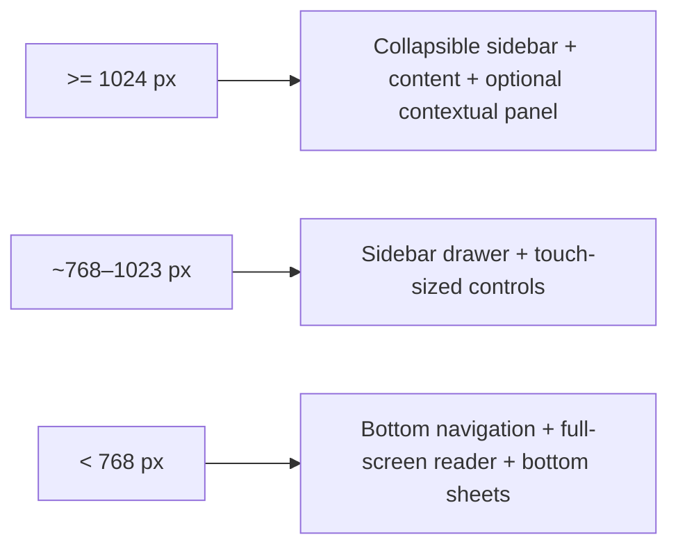

# Frontend design system

> **Document type: UI/accessibility contract.** Shared components and pages remain incomplete until their keyboard, responsive, theme and assistive-technology checks are recorded in [implementation-plan.md](implementation-plan.md).

## Direction

BookFlow uses a calm, content-first interface inspired by general document-workspace principles, not Notion assets, trademarks, source code, or a pixel copy. Surfaces are neutral, borders thin, shadows rare, controls compact, and animation short (roughly 100–200 ms). The reader is quieter than the library and hides secondary chrome after inactivity.

## Tokens

CSS custom properties are the only source for theme colors and core geometry:

```css
:root {
  --color-bg: #fbfbfa;
  --color-fg: #2f302e;
  --color-muted-bg: #f3f3f1;
  --color-muted-fg: #6f706d;
  --color-border: #e4e4e1;
  --color-accent: #3d665a;
  --color-destructive: #a33a35;
  --color-focus: #2e6f9e;
  --radius-sm: 4px;
  --radius-md: 7px;
  --duration-fast: 140ms;
}
```

Actual values live with frontend styles and must include full light, warm, sepia, dark, and custom-reader sets. Warm uses a restrained cream background and graphite/brown text, never bright yellow. Dark uses dark gray and off-white rather than absolute black/white. A custom theme is accepted only if text/background contrast meets WCAG 2.1 AA; controls keep an independently accessible focus/accent color.

Spacing, type scale, line height, maximum text width, radii, focus ring, shadows, z-index layers, and transition duration are named tokens. Book typography is separate from application typography.

## Component contracts

The shared library should cover Button, IconButton, Input, Textarea, SearchInput, Select/Combobox, Checkbox/Switch, menu/context menu, Popover/Tooltip, Dialog/AlertDialog, Drawer/BottomSheet, Tabs, Badge/Avatar, BookCard, ProgressBar, DataTable/Pagination, Empty/Error/Loading/Skeleton, Toast, Sidebar/Breadcrumbs, and CommandPalette.

Every interactive primitive has:

- semantic element/role and accessible name;
- visible `:focus-visible`, logical tab order, Escape/Enter/arrow behavior where applicable;
- disabled, pending, error and high-contrast behavior;
- touch target appropriate for mobile without making desktop controls oversized;
- focus trap for modal layers and focus restoration to the trigger;
- reduced or removed motion under `prefers-reduced-motion`;
- no state communicated by color alone.

Do not create page-local clones with subtly different padding, focus, error or menu behavior. Feature wrappers can compose primitives without changing their accessibility contract.

## Responsive shell



The desktop sidebar persists collapsed state and shows tooltips for icon-only items. Tablet uses a focus-trapped drawer. Mobile exposes library, reading, dictionary, statistics, and profile in bottom navigation with safe-area padding. No page should require horizontal scrolling at a supported viewport.

## Command palette

`Ctrl+K`/`Cmd+K` opens a dialog with a combobox/listbox relationship. Search is debounced/cancellable and groups books, vocabulary, navigation and actions. Arrow keys move the active descendant, Enter selects, Escape closes, and focus returns to the invoker. Recent actions are local metadata, not a second source of truth for books. Loading, no results, partial API error and offline states are distinct.

## Reader

Reader controls are compact and may fade only after inactivity; keyboard/touch/mouse activity restores them. Content remains readable without hover. TOC uses a drawer, settings use popover/sidebar, and translation uses an anchored popover on wide screens or bottom sheet on mobile. The popover avoids covering the selection and exposes loading, error, retry, add-to-dictionary and status states.

Scroll and paginated modes share the same locator/progress contract. Settings include theme/colors, font family/size/weight, line/letter spacing, text width/margins, alignment, mode, progress/time visibility, and UI brightness. Global and per-book overrides visibly distinguish effective values.

## Data-heavy views

Library supports grid/list/table without duplicating business state. Dictionary tables use sticky headers only where they do not impair screen readers, virtualization only after measurement, and an accessible non-virtual fallback/test strategy. Statistics prioritize a few answer-first metrics, small charts and tables; charts include text summaries/tooltips and do not rely on color alone.

## Verification

Run component tests for keyboard/focus behavior and automated accessibility checks, then manually test VoiceOver/NVDA, 200% zoom, keyboard-only, reduced motion, light/warm/dark contrast, mobile selection/bottom sheet, offline sync, and high-content/long-language strings in Russian and English.
