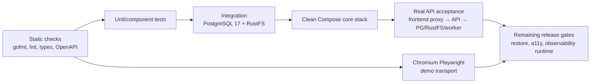

# Статус реализации и план развития

> **Снимок состояния: 2026-07-16.** В этом документе «реализовано» означает наличие рабочего кода, а «проверено» — наличие фактически выполненной команды или acceptance-сценария. Локальный core MVP реализован и прошёл автоматизированную проверку, но это не production/HA-релиз и не заявление о 100% покрытии.

## Резюме

BookFlow собран как исполняемый monorepo: Go API и worker, PostgreSQL-backed migrations/jobs, RustFS S3 storage, React PWA, OpenAPI 3.1, Docker Compose, CI и эксплуатационная документация. Чистый core stack поднимался с пустыми volumes; live/ready/frontend smoke и реальный HTTP acceptance через frontend proxy прошли. Acceptance включал регистрацию, cookie/CSRF, загрузку и обработку TXT/FB2/EPUB, чтение, progress conflict, reading sessions, mock translation/cache, dictionary, annotations, ownership, corrupt EPUB, ZIP bomb и reprocess.

Автоматизированный Playwright suite проходит с `VITE_DEMO_MODE=true` в Chromium. Дополнительно выполнен authenticated UI/API-аудит на реальном backend: desktop-сценарии, 13 mobile routes, upload/reader/translation/dictionary и production-container регистрация через оба loopback-origin. Автоматический demo suite и real-backend browser evidence всё равно фиксируются как разные слои проверки.

## Матрица workstream

| Направление                    | Фактическое состояние                                                                                                                                                  | Проверено 2026-07-16                                                                                                                                         | Оставшиеся границы                                                                                                                     |
| ------------------------------ | ---------------------------------------------------------------------------------------------------------------------------------------------------------------------- | ------------------------------------------------------------------------------------------------------------------------------------------------------------ | -------------------------------------------------------------------------------------------------------------------------------------- |
| Monorepo и core infrastructure | `.env`, Make, Compose, CI, PostgreSQL 17, RustFS init, migrations, API, worker, frontend                                                                               | Compose render; clean-volume start; live/ready/frontend `200`; security headers/metrics; real acceptance; restart/persistence                                | single-host Compose не HA; production backup/restore остаётся отдельным gate                                                           |
| Архитектура и документация     | modular monolith, data/storage/security/processing/reading docs и ADR                                                                                                  | структура сверена с финальным кодом; status обновлён                                                                                                         | production topology и capacity должны уточняться после load/restore drills                                                             |
| OpenAPI 3.1                    | 69 операций на 49 paths, единые errors/security/schemas/examples                                                                                                       | Gin/OpenAPI inventory совпадает; Redocly 2.39.0: 0 errors/0 warnings; TypeScript schema сгенерирована; frontend lint/typecheck PASS                       | locator representation требует унификации; contract diff должен оставаться CI gate                                                     |
| PostgreSQL и migrations        | полный initial schema, constraints/indexes, Bun models, paired down migration                                                                                          | реальный PostgreSQL 17; embedded migrations; up/down/up; integration suite                                                                                   | production expand/contract rollout, PITR и restore rehearsal не выполнены                                                              |
| Identity и security            | Argon2id, JWT audience, HttpOnly cookies, signed CSRF, refresh rotation/reuse-family revocation, device management, CORS/trusted proxies/headers                       | unit/HTTP/integration; неизвестные JSON-поля; locale validation; reuse attack; real auth/CSRF acceptance                                                     | rate limiter process-local; внешний TLS/reverse proxy/secret manager вне repo runtime                                                  |
| Books и processing             | upload, immutable original, TXT/FB2/EPUB parsers, XHTML-aware sanitizer, NCX/EPUB3 TOC, custom JPEG/PNG/WebP covers, worker jobs, deterministic chapter IDs, reprocess, download/assets | parser/cover tests; corrupt/ZIP limits; real TXT/FB2/EPUB acceptance; live custom-cover upload/stream/delete; durable chapter references remapped       | reprocess заменяет пользовательский title извлечённым из файла; adversarial fuzz corpus и длительный soak/load остаются hardening      |
| Jobs и worker                  | `SKIP LOCKED`, priority, retry/backoff, max attempts/dead, stale lease recovery, executable worker                                                                     | PostgreSQL integration: enqueue → claim → retry → dead, complete, RecoverStale                                                                               | у выполняющегося job нет периодического lease heartbeat; очень длинный handler может быть ошибочно recovered                           |
| Reading и progress             | server-time start/heartbeat/finish, idle/focus/visibility accounting, replay key, sequence, stale finalizer, revision conflict                                         | unit + PostgreSQL concurrent integration + real API acceptance                                                                                               | cross-midnight seconds не делятся между локальными датами; locator formats неоднородны; real browser multi-device conflict не проверен |
| Translation                    | mock и OpenAI Responses adapters, bounded context, timeout/retry, process-local circuit breaker/single-flight, versioned PostgreSQL cache                              | mock acceptance; cache/provider/prompt provenance integration; OpenAI adapter unit tests                                                                     | live OpenAI credentials не использовались; нет durable long-translation job/lease heartbeat                                            |
| Dictionary                     | CRUD/search/filter/status/delete/restore, dedupe, occurrences, reader context, JSON export                                                                             | PostgreSQL dedupe/occurrence/ownership integration; real acceptance; frontend page/unit contracts                                                            | export ограничен первыми 100 entries; нет chunked/full background export в `user-exports`                                              |
| Preferences и annotations      | global/per-book preferences, themes/typography, bookmarks, highlights, versioned block notes, sanitization                                                             | service/unit/integration и real API acceptance, включая чужие child refs и `javascript:` URLs                                                                | полная browser a11y/selection/mobile translation проверка ограничена demo E2E                                                          |
| Statistics                     | overview, полные календарные недели Monday–Sunday с навигацией, daily/weekly/monthly, books, sessions, streak, dictionary, repeatable rebuild                           | PostgreSQL aggregates/timezone/recompute integration; timezone-safe week-range unit tests; desktop/mobile E2E                                                | median и translation count пока `0`; cross-midnight split отсутствует                                                                  |
| Observability                  | structured logs, request ID, Prometheus metrics, Bun/HTTP/worker/reading/translation metrics, OTel exporter wiring, optional Uptrace dependency profile                | build, metrics/headers smoke, core runtime; Compose model с observability profile валиден                                                                    | полный Uptrace + ClickHouse + PostgreSQL + Redis + Collector runtime не запускался                                                     |
| Frontend и PWA                 | auth/library/book/reader/dictionary/statistics UI, custom book covers, custom whole-app palette, simplified sidebar, command palette, preferences, demo/real transports, PWA/offline queue | format/lint/types; 39 Vitest tests; production/PWA build; 12 desktop/mobile Chromium demo E2E; authenticated real-backend cover lifecycle and UI sweep | offline reconnect и WebKit/Firefox не доказаны end-to-end                                                                              |
| QA и release                   | CI jobs, container integrations, smoke/acceptance tooling, deployment/security/testing docs                                                                            | локальные gates ниже прошли                                                                                                                                  | GitHub-hosted run, production backup/restore, screen-reader audit, optional observability runtime и registry release остаются gates    |

## Реализованный MVP-контур

### M0 — исполняемая основа

- [x] `cmd/api`, `cmd/worker`, `cmd/migrate`, `cmd/seed` и runtime Dockerfiles.
- [x] Runtime configuration validation, production-only cookie/storage restrictions и env bootstrap.
- [x] Development seed идемпотентен и fail-closed при `APP_ENV=production`.
- [x] Migration up/down/up на PostgreSQL 17.
- [x] Clean-volume core Compose: PostgreSQL, RustFS, bucket init, migrations, API, worker и frontend.
- [x] Liveness, readiness, metrics, security headers и graceful process wiring.
- [ ] Полный optional observability runtime; проверена только Compose-модель и core telemetry wiring.

### M1 — identity и owned library

- [x] Register/login/refresh rotation/logout/logout-all/me/devices, cookie + signed CSRF.
- [x] Bounded EPUB/FB2/TXT upload, durable original, worker processing, polling, TOC/chapter/download/assets.
- [x] Parent/child ownership для книг, глав, progress, sessions, dictionary и annotations.
- [x] Corrupt EPUB, ZIP bomb и повторная обработка без duplicate chapters.

### M2 — чтение

- [x] Reader UI, scroll/paged modes, themes и типографика.
- [x] Revision-safe progress и global/per-book preferences.
- [x] Start/heartbeat/finish/stale-finalize, server-time accounting, idempotency и sequence checks.
- [x] Daily/book/session statistics, timezone grouping, полные листаемые календарные недели и repeatable rebuild.
- [ ] Split одной сессии по локальной полуночи и полная locator interoperability.

### M3 — перевод, словарь и annotations

- [x] Mock/OpenAI provider abstraction, PostgreSQL cache, timeout/retry/circuit/single-flight.
- [x] Dictionary CRUD/dedupe/occurrence/restore/search/filter/export.
- [x] Bookmarks, highlights и versioned block notes с ownership/sanitization.
- [x] Desktop/mobile UI surfaces для reader, dictionary, notes, statistics и пользовательских book covers.
- [ ] Live external-provider acceptance и масштабируемый полный dictionary export.

### M4 — release hardening

- [x] PWA manifest/service worker, bounded offline position queue и build verification.
- [x] Desktop/mobile Chromium demo smoke, keyboard command palette и critical component tests.
- [x] Clean core runtime и реальный API acceptance.
- [ ] Screen-reader/manual accessibility matrix, Firefox/WebKit browser matrix и real-API browser E2E.
- [ ] Load/soak, parser fuzz corpus, production backup/restore и rollback drill.
- [ ] Full observability runtime, alerts, image signing/SBOM и external secret-manager rollout.

## Матрица проверок

Результаты ниже относятся к локальному snapshot, а не к ещё не запущенному GitHub-hosted workflow.

| Проверка                                                    | Результат              | Evidence                                                                                                                                                                             |
| ----------------------------------------------------------- | ---------------------- | ------------------------------------------------------------------------------------------------------------------------------------------------------------------------------------ |
| `go test ./...`                                             | PASS                   | backend packages, 2026-07-16                                                                                                                                                         |
| `go test -race -short ./...`                                | PASS                   | backend unit/HTTP tests, 2026-07-16                                                                                                                                                  |
| `go test -count=1 -tags=integration ./internal/integration` | PASS                   | актуальный suite, PostgreSQL 17 + RustFS, включая reprocess reference remap, package `7.323s`                                                                                        |
| integration race                                            | PASS                   | package `5.130s`; race reports нет; macOS linker warning не менял exit code 0                                                                                                        |
| gofmt / `go vet ./...` / `go mod tidy -diff`                | PASS                   | formatting, static analysis и module consistency                                                                                                                                     |
| golangci-lint                                               | PASS                   | 2026-07-16                                                                                                                                                                           |
| `go build ./cmd/...`                                        | PASS                   | api/worker/migrate/seed                                                                                                                                                              |
| frontend `format:check`                                     | PASS                   | Prettier                                                                                                                                                                             |
| frontend `lint`                                             | PASS                   | ESLint, 0 warnings                                                                                                                                                                   |
| frontend `typecheck`                                        | PASS                   | strict TypeScript build graph                                                                                                                                                        |
| frontend `test:coverage`                                    | PASS                   | 17 files / 39 tests; 24.06% statements, 21.74% branches, 17.90% functions, 24.70% lines                                                                                              |
| frontend `build`                                            | PASS                   | 1,991 modules; main 385.24 kB / 118.61 kB gzip; Reader 56.78 kB / 19.60 kB gzip; PWA 38 entries / 692.42 KiB                                                                         |
| frontend `test:e2e`                                         | PASS с ожидаемыми skip | 12 passed + 2 project-specific intentional skips; desktop/mobile Chromium; demo transport                                                                                            |
| `scripts/check-openapi-routes.py`                           | PASS                   | 69 operations / 49 paths совпадают с Gin                                                                                                                                             |
| Redocly OpenAPI lint                                        | PASS                   | 0 errors / 0 warnings                                                                                                                                                                |
| OpenAPI TypeScript generation                               | PASS                   | после уточнения heartbeat schema: без warnings, generated schema 4,140 строк; frontend lint/typecheck PASS                                                                           |
| Compose core + observability render                         | PASS                   | `docker compose ... config --quiet`                                                                                                                                                  |
| Shell/env validation                                        | PASS                   | `sh -n`, bootstrap/placeholder validation                                                                                                                                            |
| Migration round-trip                                        | PASS                   | PostgreSQL 17 up → down → up                                                                                                                                                         |
| Clean core Compose + `make smoke`                           | PASS                   | API live/ready, frontend `200`, PostgreSQL/RustFS/API/worker healthy                                                                                                                 |
| Real API acceptance                                         | PASS                   | frontend proxy → API → PostgreSQL/RustFS/worker, `5.79s`; TXT/FB2/EPUB и critical domain flows                                                                                       |
| Docker image builds                                         | PASS                   | `docker compose --env-file ../work/qa.env build api worker migrations`, final current source, `11.61s`; frontend final image rebuilt за `14.42s`                                     |
| Seed idempotency / production refusal                       | PASS                   | два dev-запуска: exit `0`, около `0.95s`/`0.92s`, ровно 1 demo user; `APP_ENV=production`: ожидаемый отказ, exit `1`                                                                 |
| Restart/persistence                                         | PASS                   | frontend proxy выдержал API `force-recreate`; favorite/tags, processing v2, progress 25%, global/per-book preferences, TOC, finished session и RustFS original 152 bytes сохранились |
| Optional observability runtime                              | НЕ ЗАПУСКАЛСЯ          | config validation не равна runtime verification                                                                                                                                      |

Перед успешной финальной backend-сборкой две попытки загрузки Alpine base image завершились transient Docker Hub EOF. После восстановления сети та же build-команда собрала `api`, `worker` и `migrations` из текущего source; это сохранено как диагностический факт, а не как незакрытое ограничение проекта.

## Что покрывает backend integration suite

- embedded migrations на реальном PostgreSQL 17;
- register locale/unknown fields, refresh rotation и reuse-family revocation;
- concurrent optimistic progress и ownership книги/главы/device;
- heartbeat idempotency/sequence, active/idle, gap cap, finish и stale finalization;
- dictionary dedupe/occurrences/ownership;
- translation cache/single-flight/provider-model-prompt provenance;
- annotation ownership, HTML sanitization и unsafe URLs;
- statistics/timezone/recompute;
- jobs retry/dead/complete/stale recovery;
- book processor persistence и repeated-delivery idempotency;
- реальный RustFS: пять buckets, Put/Get/Exists/presign/delete/not-found.

Это сильное critical-path покрытие, но не 100%: оно не заменяет parser fuzzing, multi-replica races, длительный soak, production restore и полный browser/API E2E.

## Дефекты, найденные и исправленные интеграционным QA

1. Неверные Bun aliases в PostgreSQL UPSERT словаря и translation cache.
2. Hardcoded `translation_cache.prompt_version` вместо фактической версии prompt.
3. Некорректный default progress locator.
4. Отсутствующие проверки ownership для `chapter_id`, `device_id` и annotation child references.
5. Начисление искусственного active time при `finish` после последнего heartbeat.
6. Unsafe `javascript:` URLs в note blocks.
7. Rollback family-wide revoke при refresh-token reuse.
8. Неправильное отображение RustFS/AWS `NoSuchKey`/`StatusCode: 404` в `storage.ErrNotFound`.
9. HTTP `500` вместо `400 VALIDATION_ERROR` для неподдерживаемого locale.
10. Несовпадения HTTP DTO/OpenAPI/frontend naming, выявленные contract audit.
11. Закешированный IP API в frontend Nginx давал `502` после пересоздания контейнера; добавлены Docker DNS resolver, dynamic upstream resolution и shared upstream zone, `nginx -t`/restart regression прошли.
12. Library `NavLink` подсвечивал сразу Library/Continue/Recent/Favorites, а collapsed sidebar прятал expand в footer; добавлены query-aware единственное active state, чистая 64 px icon rail, верхняя expand-кнопка и keyboard/E2E regression.
13. Регистрация с production frontend по `http://127.0.0.1:3000` возвращала CORS `403`; development/Compose allowlist теперь явно включает оба loopback-hostname (`localhost` и `127.0.0.1`), browser registration вернула `201` и открыла Library.
14. XHTML из реального EPUB с self-closing `<title/>` передавался целиком HTML5-санитайзеру: tokenizer входил в raw-text mode, поэтому 49/49 глав сохранялись как `&lt;p...` и отображали теги текстом. Теперь XML-aware extraction оставляет только `<body>`, classed `title1…title6` нормализуются в `h1…h6`, NCX/EPUB3 nav даёт осмысленные заголовки, а небезопасный head/CSS/script удаляется. На загруженной книге после reprocess: 49 глав, 0 generic titles, 0 escaped chapters, 0 markup в plain text.
15. Reprocess менял versioned chapter IDs, но оставлял progress/bookmarks/highlights/word occurrences на старой версии. Финальная processing-транзакция теперь детерминированно remap'ит эти ссылки по `source_ref` + occurrence, повышает progress revision и остаётся идемпотентной при повторной доставке job.
16. Reader показывал заголовок главы дважды, когда исправленный EPUB начинался тем же `h1…h6`, который уже выводит UI. Теперь только точное нормализованное совпадение первого semantic heading с `chapter.title` скрывается на уровне рендера; другой заголовок и authored text перед heading сохраняются. Добавлены 3 DOM regression tests.
17. Paged mode применял `break-inside: avoid` ко всему верхнеуровневому EPUB wrapper и оставлял почти пустую первую страницу; keyboard navigation отдельно вычисляла шаг из сохранённого margin и на mobile перелистывала на 32 px дальше фактической CSS-колонки, обрезая начало строк. Ограничение перенесено только на UI heading/navigation, а шаг теперь равен `clientWidth + computed column-gap`; добавлены 2 regression tests и real-EPUB mobile/desktop browser verification.
18. По UX-запросу из desktop sidebar и mobile drawer удалены дублирующие Continue/Recent destinations и блок recent books; Library остаётся единственным active destination для соответствующих query-фильтров. App theme дополнена Custom-палитрой background/foreground/accent, автоматическим light/dark native color-scheme, контрастным цветом на акценте, предупреждением ниже 4,5:1 и persisted local state. Real production frontend проверен на desktop/mobile, reload persistence, drawer composition, computed tokens, horizontal overflow и чистую console.
19. Paged reader позволял видеть горизонтальный scrollbar и мог останавливаться между CSS columns при touch/trackpad scroll. Scrollbar теперь скрыт через Firefox/WebKit-compatible правила, wheel gesture перелистывает ровно одну страницу с throttle, drag/touch после 120 ms плавно фиксируется на ближайшей полной странице, а keyboard navigation рассчитывается от ближайшей page boundary и clamp’ится на краях. Unit tests покрывают snap/navigation math; отдельный desktop/mobile Chromium E2E проверяет скрытый scrollbar и фактическую фиксацию.
20. Header и нижняя status-панель Reader раньше автоматически уезжали после 4,2 секунды бездействия/фокуса на тексте. Auto-hide state, таймеры и hidden CSS-состояния удалены; обе панели теперь постоянно fixed и видимы, при этом activity tracking для reading sessions сохранён. Desktop/mobile E2E удерживает фокус на статье дольше старого timeout и проверяет видимость `banner`/`contentinfo`.

## Честные ограничения текущего MVP

### Данные и статистика

- `median_session_seconds` и `translations_count` в overview пока являются нулевыми placeholders.
- Сессия относится к bucket по `started_at`; секунды не разделяются по локальной полуночи.
- Dictionary JSON export ограничен первыми 100 entries.
- Reprocess сейчас заменяет изменённый пользователем title извлечённым из файла title. Progress/bookmarks/highlights/word occurrences теперь атомарно remap'ятся на current-version chapter IDs; preferences и остальные проверенные metadata пережили restart.

### Масштабирование и фоновые операции

- Login/register/translation rate limiter process-local и не координируется между API replicas.
- Worker умеет recover stale leases, но running handler не продлевает lease heartbeat.
- Translation выполняется синхронно; durable/resumable long-translation jobs отсутствуют.
- Circuit breaker и single-flight process-local; PostgreSQL cache общий.

### Reader и frontend

- Locator representation неоднородна между format-specific JSON, HTTP DTO и frontend string model; EPUB CFI interoperability не доказана полностью.
- Playwright automation использует demo transport и Chromium; дополнительно real backend проверен authenticated browser UI sweep, включая mobile translation/dictionary и production-container registration.
- PWA offline queue реализован как bounded MVP, но real browser multi-device/offline 409 resolution не покрыт.
- Custom theme всего приложения сохраняется локально на устройстве; серверная синхронизация этой UI-палитры между устройствами пока не реализована.
- Frontend coverage низкое по абсолютной доле; 39 tests фокусируются на critical schemas/stores/offline queue/sidebar/tabs/menu/translation/EPUB-rendering/week-range primitives.

### Operations

- Optional observability profile только config-validated.
- Local PostgreSQL/RustFS volumes и proxy recovery прошли restart regression, но это не HA/backup/restore.
- Production TLS, secret manager, PITR, coordinated PostgreSQL+RustFS restore, image registry/signing/SBOM и alerts требуют отдельного rollout.
- Manual accessibility и production-like backup/restore reports должны быть приложены до внешнего release.

## Definition of done дальше

Для следующего production-like этапа недостаточно добавить код. Требуются одновременно:

1. green CI на опубликованном commit;
2. real browser → API → PostgreSQL/RustFS E2E без demo transport;
3. cross-midnight/DST и locator contract fixes;
4. distributed rate limiting и lease heartbeat для долгих jobs;
5. full dictionary export и реальные median/translation aggregates;
6. optional observability runtime с traces/metrics/log correlation;
7. backup/restore, rollback, load/soak, accessibility и security evidence.

До выполнения этих пунктов BookFlow следует называть **проверенным локальным MVP**, а не production-ready системой.
