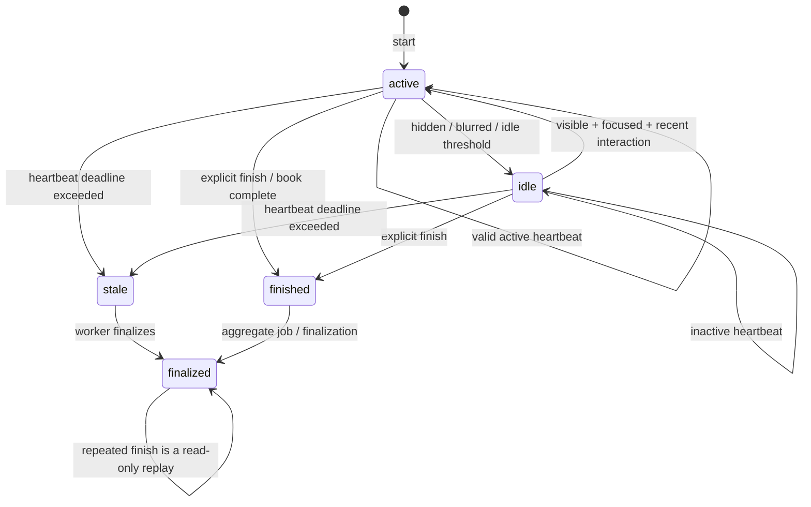
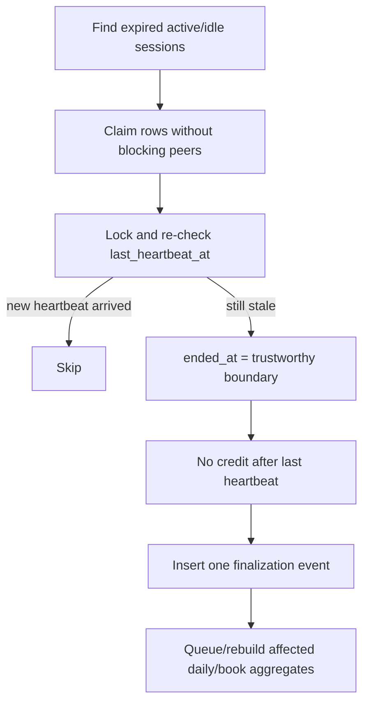

# Reading-session and progress algorithms

> **Document type: required algorithm.** Source-level helpers may exist before database locking/idempotency/worker/API integration is complete. Only the verification record in [implementation-plan.md](implementation-plan.md) establishes implemented behavior.

## Objectives

The system records when a session began and ended, but does **not** call all wall-clock time “reading.” Active time is credited only while the page is visible, the window is focused, recent user interaction exists, and heartbeats arrive within configured bounds. Server time is authoritative. Client timestamps help diagnose skew and offline replay but never create arbitrary credit.

Default development values are illustrative and configurable:

| Setting | Default | Purpose |
|---|---:|---|
| heartbeat interval | 15 s | expected client cadence |
| heartbeat grace | 10 s | network scheduling tolerance |
| idle threshold | 60 s | interaction age after which active credit stops |
| max credited interval | 30 s | cap for one heartbeat |
| stale session age | 2 min | worker finalization threshold |

Production values must be tested against mobile backgrounding and real network latency. They are not security boundaries by themselves.

## Session lifecycle



`finish` is idempotent. A duplicate request returns the already-finished state and adds zero seconds. A session marked `stale` can be finalized using only the last accepted heartbeat; the worker never credits the unseen interval after it.

## Start

1. Authenticate the user and derive `user_id` from auth context.
2. Verify book ownership and `ready` state; verify the device belongs to the user.
3. Validate locator/progress bounds.
4. Claim the start idempotency key in the same PostgreSQL transaction.
5. Resolve an existing safe replay or create a session with server `started_at`, `last_activity_at`, and `last_heartbeat_at`.
6. Emit one `session_started` event. Never emit duplicates for a replay.

The API may finish an existing active session on the same device/book with `switched_book`, or reject the start with a conflict; this policy must be deterministic and tested.

## Heartbeat payload

The request includes locator, progress, `tab_visible`, `window_focused`, `user_active`, milliseconds since last interaction, client timestamp, sequence number, and a required `Idempotency-Key` header. The server also records receive time and request ID.

```mermaid
sequenceDiagram
    participant C as Client
    participant H as Heartbeat use case
    participant D as PostgreSQL
    C->>H: heartbeat(key, sequence N, activity flags)
    H->>D: BEGIN; lock owned session
    alt key already committed with same fingerprint
      D-->>H: stored result
      H-->>C: replayed=true, credited=0
    else key reused with different request
      H-->>C: 409 conflict
    else N <= last accepted sequence
      H-->>C: safe replay/conflict, credited=0
    else valid new sequence
      H->>H: delta = received_at - last_heartbeat_at
      H->>H: clamp delta and evaluate visibility/focus/idle
      H->>D: update counters, locator, sequence; insert bounded event/key
      D-->>H: COMMIT
      H-->>C: credited interval + server timestamp
    end
```

### Crediting rule

Let:

- `now` be the database/application server receive time from an injected clock;
- `previous` be the last accepted server heartbeat time;
- `raw = max(0, now - previous)`;
- `eligible = tab_visible && window_focused && user_active && interaction_age < idle_threshold`;
- `fresh = raw <= heartbeat_interval + heartbeat_grace`;
- `bounded = min(raw, max_credit_interval)`.

For a new heartbeat:

```text
active_delta = bounded  if eligible and fresh
active_delta = 0        otherwise
idle_delta   = bounded  if not eligible and raw is within the accounting window
```

An implementation can classify late time as idle for diagnostics, but it must not claim that the user was active after heartbeats disappeared. Negative time, client-proposed deltas, and anomalously large deltas earn no extra credit. Counters are non-negative integers; define sub-second rounding once and test it.

### Sequence policy

- same idempotency key + same request fingerprint: replay the stored result;
- same key + different fingerprint: `409`;
- sequence equal to an accepted sequence: replay/no credit;
- lower sequence: stale/no credit (or explicit `409` with current sequence);
- a forward gap may be accepted because mobile clients lose requests, but it earns only one bounded server interval;
- sequence state is per session, so devices cannot corrupt each other.

The transaction locks the session and commits the idempotency record, event, and counters atomically. Two API replicas therefore cannot both credit the same interval.

## Finish and stale finalization

Explicit finish validates ownership, locks the session, applies at most a final bounded interval under the same eligibility rules, stores end locator/progress and server `ended_at`, sets a constrained close reason, and inserts one `session_finished` event. `navigator.sendBeacon` may send the same contract; its delivery is best-effort.

The worker periodically claims unfinished sessions whose `last_heartbeat_at < now - stale_after`. It uses an advisory lock or `SKIP LOCKED`, sets `stale`/`finalized`, sets `ended_at` to the last trustworthy activity/heartbeat boundary (not worker `now` as reading time), adds no unseen active time, and emits `session_finalized` once.



## Progress synchronization

Progress and session accounting are related but separate: losing a heartbeat must not lose a valid latest reading position.

```mermaid
sequenceDiagram
    participant A as Device A
    participant B as Device B
    participant API
    participant DB
    A->>API: PUT revision=8, position A
    API->>DB: UPDATE ... WHERE revision=8; set revision=9
    API-->>A: revision=9
    B->>API: PUT revision=8, position B
    API->>DB: conditional update affects 0 rows
    API->>DB: read current revision=9
    API-->>B: 409 + current state
    B->>B: resolve with server timestamp and user-visible policy
    B->>API: retry revision=9 if chosen
```

The locator contains a primary format-specific locator plus chapter ID, character offset, bounded text anchor, and within-chapter percentage. Updates require a revision and idempotency key. The server rejects invalid chapter ownership and out-of-range data. A PWA offline queue preserves order and coalesces obsolete local positions before syncing.

## Events and aggregation

Store important state changes (`session_started`, heartbeat, visibility/focus transitions, idle/resumed, position changed, finished/finalized, book finished), not every scroll. Heartbeat events can be sampled or compacted after canonical counters are finalized. Daily aggregates split a session at boundaries in the **user-selected IANA timezone**, including DST, while stored instants stay UTC. Rebuild jobs delete/upsert a bounded affected range so reruns are identical.

## Required tests

At minimum: duplicate heartbeat, same key/different payload, out-of-order and gapped sequences, hidden/blurred/idle combinations, interval cap, negative/skewed client time, duplicate finish, finish racing heartbeat, stale finalizer racing a returning heartbeat, cross-device sessions, progress revision conflict, DST day split, aggregate rebuild idempotency, and application restart with durable counters.
