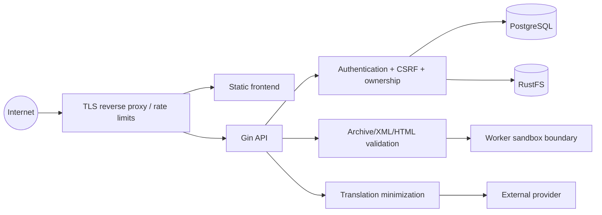

# Security model

> **Document type: security requirements and threat model.** Controls listed here are not a certification that they are all wired. Release requires the checks and evidence tracked in [implementation-plan.md](implementation-plan.md).

## Trust boundaries

The browser, uploaded book, locator/context payload, client clock, external translator response, original filename, and all IDs in a request are untrusted. PostgreSQL and RustFS are trusted only after authenticated network connections and application-level ownership/integrity checks. Telemetry is an operational system, not an authorization source.

## Authentication and session handling

- Passwords are hashed with Argon2id using versioned, calibrated parameters and a unique random salt. Enforce a reasonable minimum length and maximum byte length; never log the password.
- Access tokens are short lived. Refresh tokens are high entropy, stored only as hashes, bound to a session/device, rotated on every use, and revoked as a family if a consumed token is replayed.
- Browser credentials use `HttpOnly`, `Secure` in production, an explicit domain/path, and `SameSite=Lax` or stricter. Access tokens are not stored in `localStorage`.
- State-changing cookie-auth requests require a validated CSRF token/origin policy. CORS permits an exact configured origin list and credentials; never combine wildcard origin with credentials.
- Logout revokes one session; logout-all revokes all user sessions/token families. Sensitive account changes should revoke or reauthenticate as policy requires.
- Login/register/refresh responses should not enable email enumeration. Apply per-account and per-network throttles with safe retry guidance.

## Authorization

Every user-resource query includes the authenticated `user_id` predicate or validates it in the same transaction. Do not fetch by public UUID and “check later” if a scoped query is possible. A body `user_id` is ignored/rejected. Child resources (chapter, bookmark, occurrence, note, asset) are joined through the owned parent. Return a stable `404` where distinguishing existence would leak cross-user information.

Presigned URLs are issued only after this authorization, for one trusted bucket/key/method, with a short TTL. RustFS credentials are server-only.

## Upload and content defenses

| Threat | Controls |
|---|---|
| oversized body / memory exhaustion | reverse-proxy and Gin body limits, streaming hash/upload, timeouts |
| spoofed extension/MIME | independent extension, sniffed MIME, signature/container validation |
| ZIP bomb | entry count, per-entry and total inflated bytes, compression ratio, nesting/time limits |
| path traversal/symlink | reject absolute/parent/NUL paths and links; no client-derived disk/object paths |
| XML entity expansion | streaming parser; no external entities/DTDs; size/depth limits |
| stored XSS in EPUB/FB2/notes | strict allowlist sanitizer, safe URL rewriting, escaped text, reader CSP |
| malicious images/assets | type sniffing, size/dimension limits, controlled serving headers, no SVG unless sanitized policy exists |
| parser exploit/resource starvation | dedicated worker, deadlines, concurrency/memory limits, least privilege, current dependencies |

The original remains quarantined/private until validation. Parsed chapter HTML is treated as untrusted even after sanitization and rendered without script privileges.

## API and platform controls

- Validate JSON/multipart shape, enum/range/length, UUID, pagination cursor, locator structure, sequence and revision. Reject unknown fields for mutation DTOs where practical.
- Use parameterized Bun/SQL queries; never concatenate user values into SQL/order clauses. Map sorting to an allowlist.
- Apply uniform errors with request ID; do not return SQL, stack traces, paths, secrets, object keys, provider diagnostics, or parser internals.
- Set HSTS (after TLS rollout), CSP, `X-Content-Type-Options: nosniff`, `Referrer-Policy`, `Permissions-Policy`, frame restrictions, safe cache controls, and a deliberate cross-origin policy.
- Validate redirects against an allowlist or use relative internal paths.
- Rate limit login, registration, refresh, uploads, translation, expensive search/export, and abuse-prone mutations. Limits complement—not replace—authorization.
- Idempotency records bind key, authenticated user, operation and request fingerprint; a reused key with different input conflicts.
- Containers use a non-root user where images support it, `no-new-privileges`, minimal writable paths, pinned/tested images, healthchecks, resource limits, and private data networks. Do not mount the Docker socket.

## Secrets and logs

`.env.example` contains placeholders/development values only. Production secrets come from a secret manager or protected files, not Git, image layers, Compose command arguments, or frontend `VITE_*` variables. Separate JWT, CSRF, PostgreSQL, RustFS, Uptrace and provider secrets. Rotate them with a documented overlap/revocation procedure; rotating JWT keys may need key IDs.

Structured logs and OTel attributes may contain internal user/resource UUIDs when necessary for operations, but not passwords, tokens, cookies, raw book text, complete translated selections, email by default, or provider keys. Hash or redact network identifiers according to retention/privacy policy. Metrics use bounded labels—never user IDs, book titles, words, object keys, request paths containing UUIDs, or error strings.

## Threat review checklist

Before release:

1. run dependency, container and secret scans; generate an SBOM for both images;
2. test cross-user access for every resource type and nested path;
3. test CSRF/CORS/cookie flags behind the real TLS proxy;
4. fuzz/archive-test EPUB/FB2/TXT parsers and sanitizer, including ZIP bombs;
5. verify refresh rotation/replay, logout-all, idempotency and concurrency races;
6. inspect logs/traces/errors for sensitive content;
7. exercise backup/restore and account/book deletion;
8. review RustFS bucket policies, public access, presigned TTL and TLS;
9. establish vulnerability/incident contacts, patch SLA, audit retention and breach response.

## Known security limitations of local Compose

Local ports bind to loopback, but traffic is plaintext, credentials live in `.env`, RustFS is single-node, and Uptrace bootstrap passwords are supplied by configuration. It is not a production perimeter. See [deployment.md](deployment.md) for required production controls.
