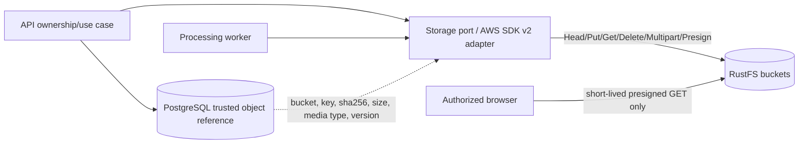
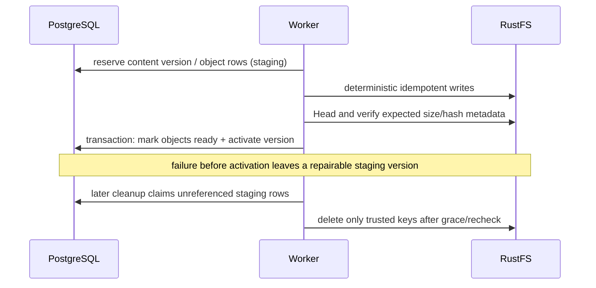

# RustFS object storage

> **Document type: target storage contract.** Treat checksums, multipart behavior, telemetry, reconciliation and production durability as requirements until verified against the adapter and deployment; status is in [implementation-plan.md](implementation-plan.md).

RustFS is used through the AWS SDK for Go v2 S3 client with path-style addressing for local development. PostgreSQL stores ownership and trusted bucket/key references; it does not store book binaries. Original filenames are display metadata only.

## Buckets and keys

| Bucket | Example key | Content |
|---|---|---|
| `books-original` | `users/{user_id}/books/{book_id}/original/{sha256}` | immutable uploaded source |
| `books-content` | `books/{book_id}/versions/{version}/chapters/{chapter_id}.html` | sanitized large chapter content |
| `books-assets` | `books/{book_id}/versions/{version}/assets/{asset_id}` | extracted images/resources |
| `books-covers` | `books/{book_id}/cover/{cover_id}` | normalized covers/thumbnails |
| `user-exports` | `exports/{user_id}/{export_id}` | short-retention user exports |

IDs and hashes are canonicalized and generated server-side. Keys are constructed by a small storage-key module; handlers never join a client filename/path. The `rustfs-init` Compose job idempotently creates all five buckets using the AWS CLI after `/health` succeeds.

## Interaction model

Supported adapter operations are bucket bootstrap/check, object existence/head, streaming upload/download, safe delete, short-lived presigned GET, and multipart upload for large files. Every call has context cancellation, operation timeout, retry classification, request/trace correlation, latency/error/byte metrics, and response-body closure.

## Write protocol

1. Validate authorization and content before choosing a key.
2. Persist intent/state in PostgreSQL where the flow needs repairability.
3. Stream upload with a known maximum; use multipart above a configured threshold.
4. Record ETag/checksum/byte length/media type. SHA-256 is authoritative for application integrity; do not assume a multipart ETag is MD5.
5. Mark the database object/version available only after a successful head/integrity check.
6. On retry, head the deterministic key and compare expected metadata rather than blindly duplicating.

Abort incomplete multipart uploads on error/cancellation. Configure a lifecycle policy to remove abandoned multipart parts after a safe window. A reconciler can detect old database intents without objects and unreferenced objects older than a grace period.

## Read and presign protocol

The API looks up the object through an owned book/export row and never accepts an arbitrary bucket/key. Proxy small/sensitive data or return a presigned URL with a default TTL around five minutes. The URL grants exactly one HTTP method/object and must not expose permanent credentials. Configure RustFS public endpoint separately from the container endpoint so browser URLs use a reachable TLS host in production.

Set conservative cache headers: immutable versioned assets/content can be cached; originals and exports default private; user deletion/revocation is considered when choosing TTL. Reader HTML is still sanitized and rendered under a restrictive CSP.

## PostgreSQL and RustFS consistency

Never delete an original because parsing failed. Book deletion is two-phase and retryable: mark/authorize in PostgreSQL, enqueue cleanup, then delete trusted object rows/keys idempotently. If RustFS is unavailable, PostgreSQL deletion state remains and cleanup retries.

## Deployment and durability

The local Compose volume is single-node/single-disk and provides persistence across container restarts, **not high availability or a backup**. Production must pin a tested RustFS release/digest, use supported redundant disks/nodes, TLS, non-default keys from a secret manager, restricted networks, capacity/health alerts, bucket policy review, and independently tested backups/replication. Back up PostgreSQL and RustFS to a common documented recovery point; an object-only or database-only snapshot may be inconsistent.

Restore testing must verify original SHA-256, representative assets/chapters, database references, presigning, reprocessing, and deletion. See [deployment.md](deployment.md) for the runbook.
